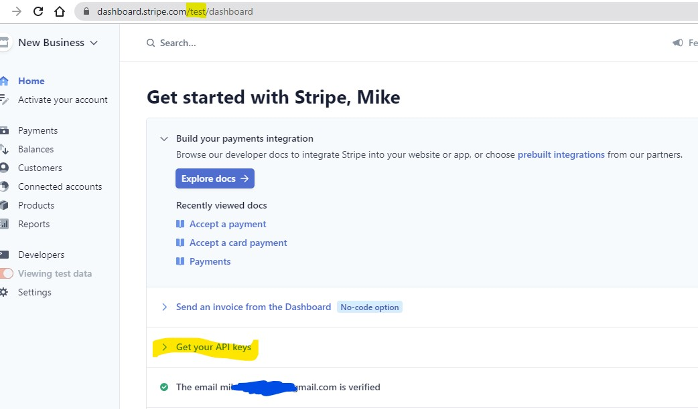

- [Install Django](#install-django)
    + [.gitignore](#gitignore)
    + [run initial migrations](#run-initial-migrations)
    + [create superuser](#create-superuser)
    + [First commit to github](#first-commit-to-github)
- [Authentication system](#authentication-system)
  * [settings.py](#settingspy)
  * [urls.py](#urlspy)
  * [Added new apps, need to migrate](#added-new-apps--need-to-migrate)
  * [Runserver, with admin](#runserver--with-admin)
  * [Additional settings.py](#additional-settingspy)
    + [With 'allauth' working, need to set up requirements.txt.](#with--allauth--working--need-to-set-up-requirementstxt)
  * [Set up Templates](#set-up-templates)
  * [git](#git)
- [Base Templates](#base-templates)
  * [Create base.html in /templates](#create-basehtml-in--templates)
  * [Create home app.](#create-home-app)
    + [index.html](#indexhtml)
    + [home/views.py](#home-viewspy)
    + [home/urls.py](#home-urlspy)
    + [project level boutique_ado/urls.py](#project-level-boutique-ado-urlspy)
    + [project level boutique_ado/settings.py](#project-level-boutique-ado-settingspy)
    + [Wire up templates directory to settings.py](#wire-up-templates-directory-to-settingspy)
    + [runserver error](#runserver-error)
    + [JSON formatter](#json-formatter)
  * [Fixtures](#fixtures)
  * [Customise Products admin](#customise-products-admin)
    + [products/models.py](#products-modelspy)
    + [products/admin.py](#products-adminpy)
  * [Set up Product views](#set-up-product-views)
    + [Queries](#queries)
    + [Specific categories of products](#specific-categories-of-products)
    + [Sorting](#sorting)
  * [Shopping Bag](#shopping-bag)
  * [Context Processors](#context-processors)
    + [Adding products to shopping bag](#adding-products-to-shopping-bag)
  * [Toasts](#toasts)
  * [checkout app and STRIPE](#checkout-app-and-stripe)
    + [models](#models)
    + [signals](#signals)
    + [checkout form](#checkout-form)
- [Gitpod Reminders](#gitpod-reminders)
- [Updates Since The Instructional Video](#updates-since-the-instructional-video)


<small><i>[TOC](http://ecotrust-canada.github.io/markdown-toc/)</i></small>


Welcome Mike Green,

This is the Code Institute student template for Gitpod. We have preinstalled all of the tools you need to get started. You can safely delete this README.md file, or change it for your own project. Please do read it at least once, though! It contains some important information about Gitpod and the extensions we use.

## boutique_ado demo project

### user stories

story id | As a | I want to be able to | So that I can
---------|------|----------------------|--------------
1.      |Shopper|View a list of products| Select some to purchase
2.      |Shopper|View individual product details|Price, description, rating and available sizes
3.      |Shopper|Identify deals, special offers and clearances|Take advantage of special savings
4.      |Shopper|Easily view the total of my purchases at any time|Avoid spending too much
5.      |Site user|Easily register for an account|Have a personal account and view my profile
6.      |Site user|Easily login or out|
7.      |Site user|Easily recover my password if I forget it|Recover access to my account
8.      |Site user|Recieve an email confirmation of registration|Verify that my account registration was successful
9.      |Site user|Have a personalised view profile|View order history
10.     |Shopper|Sort the list of available products|By rate,price,category
11.     |Shopper|Sort a specific category of product|
12.     |Shopper|Sort multiple categories simultaneously|
13.     |Shopper|Search for a product by name or description|
14.     |Shopper|Easily see what I've searched for and the number of results|
15.     |Shopper| Easily select the size and quantity of a product when purchasing it|Ensure I don't accidentily select the wrong product, size or quantity                 
16. |Shopper|View items in my bag to be purchased |
17. |Shopper|Adjust the quantity of individula items in my bag|
18. |Shopper|Easily enter my payment information|Checkout quickly, with no hassles
19. |Shopper|Personal and payment info is safe and secure|Confidently provide the info to make a purchase
20. |Shopper|View an order confirmation after checkout| Verify I haven't made mistakes
21. |Shopper|Receive an email confirmation after checkout| 
22. |Store Owner|Add a product|
23. |Store Owner|Edit/update product|
24. |Store Owner| Delete a product|Remove item that is no longer for sale.


## Install Django

```pip3 install django```

>Collecting django
  Downloading Django-3.1.5-py3-none-any.whl (7.8 MB)
     |████████████████████████████████| 7.8 MB 9.3 MB/s 
Collecting asgiref<4,>=3.2.10
  Downloading asgiref-3.3.1-py3-none-any.whl (19 kB)
Collecting sqlparse>=0.2.2
  Downloading sqlparse-0.4.1-py3-none-any.whl (42 kB)
     |████████████████████████████████| 42 kB 2.0 MB/s 
Collecting pytz
  Downloading pytz-2020.5-py2.py3-none-any.whl (510 kB)
     |████████████████████████████████| 510 kB 83.8 MB/s 
Installing collected packages: sqlparse, pytz, asgiref, django
Successfully installed asgiref-3.3.1 django-3.1.5 pytz-2020.5 sqlparse-0.4.1
WARNING: You are using pip version 20.3.3; however, version 21.0 is available.
You should consider upgrading via the '/home/gitpod/.pyenv/versions/3.8.7/bin/python3 -m pip install --upgrade pip' command.

```django-admin startproject boutique_ado . ```

- 


#### .gitignore
- core.Microsoft*
- core.mongo*
- core.python*
- env.py
- __pycache__/
- *.py[cod]
- *.sqlite3

``` python3 manage.py runserver ```

>Watching for file changes with StatReloader
Performing system checks...

>System check identified no issues (0 silenced).

>You have 18 unapplied migration(s). Your project may not work properly until you apply the migrations for app(s): admin, auth, contenttypes, sessions.
Run 'python manage.py migrate' to apply them.
January 23, 2021 - 16:55:30
Django version 3.1.5, using settings 'boutique_ado.settings'
Starting development server at http://127.0.0.1:8000/
Quit the server with CONTROL-C.

#### run initial migrations

```python3 manage.py migrate```

#### create superuser

``` python3 manage.py createsuperuser ```

username: mdjg
email address: 
password:

#### First commit to github

```git remote -v```

>origin  https://github.com/mikedjgreen/MSP4_demo.git (fetch)
origin  https://github.com/mikedjgreen/MSP4_demo.git (push)

## Authentication system

```pip3 install django-allauth```

...

>Successfully built django-allauth
Installing collected packages: pyjwt, oauthlib, requests-oauthlib, python3-openid, django-allauth
Successfully installed django-allauth-0.44.0 oauthlib-3.1.0 pyjwt-2.0.1 python3-openid-3.2.0 requests-oauthlib-1.3.0

[Allauth documentation](https://django-allauth.readthedocs.io/en/latest/installation.html)

### settings.py
Need to add allauth entries to the settings.py .

INSTALLED_APPS

-    'django.contrib.sites',

-    'allauth',
-    'allauth.account',
-    'allauth.socialaccount',

After AUTHENTICATION_BACKENDS:

```SITE_ID = 1```

### urls.py

```from django.urls import path, include```

urlpatterns = [
    path('admin/', admin.site.urls),
    path('accounts/', include('allauth.urls')),
]

### Added new apps, need to migrate

```python3 manage.py migrate```

>Operations to perform:
  Apply all migrations: account, admin, auth, contenttypes, sessions, sites, socialaccount
Running migrations:
  Applying account.0001_initial... OK
  Applying account.0002_email_max_length... OK
  Applying sites.0001_initial... OK
  Applying sites.0002_alter_domain_unique... OK
  Applying socialaccount.0001_initial... OK
  Applying socialaccount.0002_token_max_lengths... OK
  Applying socialaccount.0003_extra_data_default_dict... OK

### Runserver, with admin

```python3 manage.py runserver```

This gives a 404 error, but append /admin to URL to get:

- 

Login with mdjg.

- 

Alter site to boutiqueado.example.com.

### Additional settings.py

Temporarily log emails to console to get the confirmation links.

``` 
EMAIL_BACKEND = 'django.core.mail.backends.console.EmailBackend' 
```
```
ACCOUNT_AUTHENTICATION_METHOD = 'username_email'
ACCOUNT_EMAIL_REQUIRED = True
ACCOUNT_EMAIL_VERIFICATION = 'mandatory'
ACCOUNT_SIGNUP_EMAIL_ENTER_TWICE = True
ACCOUNT_USERNAME_MIN_LENGTH = 4
LOGIN_URL = '/accounts/login/'
LOGIN_REDIRECT_URL = '/##success##'
```

##success## is temporary setting to test.
Test this with:
``` python3 manage.py runserver ```

Get Page not found (404).

Navigate to ```/accounts/login``` at the end of the url.  


Get: 
- 

The superuser was setup prior to installing allauth, so an email has not been associated with this login.

Can set this for 'mdjg' by logging into admin.

Need to set accounts' email addresses, and search for account mdjg.
Add an email address and tick verify.

- 


#### With 'allauth' working, need to set up requirements.txt.

```pip3 freeze > requirements.txt ```

- asgiref==3.3.1
- Django==3.1.5
- django-allauth==0.44.0
- oauthlib==3.1.0
- PyJWT==2.0.1
- python3-openid==3.2.0
- pytz==2020.5
- requests-oauthlib==1.3.0
- sqlparse==0.4.1

### Set up Templates

``` mkdir templates ```

``` mkdir templates/allauth```

### git

``` git add .```

``` git commit -m "Setup allauth" ```

``` git push ```

## Base Templates

At some point we will want to customise the allauth templates within our templates\allauth directory.

pip3 installs files such as allauth in the site-packages directories.

```pwd   returns /workspace/MSP4_demo```

This is also env $THEIA_WORKSPACE_ROOT


```cd ..```

```ls -la  ```

returns 
>
- drwxr-xr-x 2 gitpod gitpod 4096 Jan 25 12:45 .gitpod
- -drwxr-x--- 6 gitpod gitpod 4096 Jan 24 16:42 MSP4_demo
-d rwxr-x--- 6 gitpod gitpod 4096 Jan 25 12:45 mysql
- drwxr-xr-x 4 gitpod gitpod 4096 Jan 23 16:41 .pip-modules
>

```cd .pip-modules```
```cd lib```
```cd python3.8```
```cd site-packages```
```ls -la```
returns

>
- drwxr-xr-x  8 gitpod gitpod 4096 Jan 23 17:28 openid
- drwxr-xr-x  2 gitpod gitpod 4096 Jan 23 17:28 PyJWT-2.0.1.dist-info
- drwxr-xr-x  2 gitpod gitpod 4096 Jan 23 17:28 python3_openid-3.2.0.dist-info
- drwxr-xr-x  4 gitpod gitpod 4096 Jan 23 16:41 pytz
- drwxr-xr-x  2 gitpod gitpod 4096 Jan 23 16:41 pytz-2020.5.dist-info
- drwxr-xr-x  4 gitpod gitpod 4096 Jan 23 17:28 requests_oauthlib
- drwxr-xr-x  2 gitpod gitpod 4096 Jan 23 17:28 requests_oauthlib-1.3.0.dist-info
- drwxr-xr-x  5 gitpod gitpod 4096 Jan 23 16:41 sqlparse
- drwxr-xr-x  2 gitpod gitpod 4096 Jan 23 16:41 sqlparse-0.4.1.dist-info
>

**but no allauth/templates directory as course vid states ????**

- From Slack: [allauth source](https://github.com/pennersr/django-allauth)

### Create base.html in /templates

Getting most of the boilerplate from bootstrap.

- [Bootstrap](https://getbootstrap.com/)

Copy [starter template](https://getbootstrap.com/docs/4.4/getting-started/introduction/#starter-template) from bootstrap's docs page onto base.html.

Adding  as needed.

### Create home app.

```python3 manage.py startapp home```

- 

```mkdir home/templates```

```mkdir home/templates/home```

```touch home/templates/home/index.html``` 

#### index.html

```




    <h1 class="display-4 text-success">It works!</h1>

```

[bootstrap](https://getbootstrap.com/docs/5.0/getting-started/introduction/):  my-auto to vertically centre contents.
[bootstrap stackoverflow](https://stackoverflow.com/questions/tagged/bootstrap-5)

### Also need CSS to format page

```mkdir static```
```mkdir media```
``` cd static```
```mkdir css```
```cd css```
```touch base.css```
#### Base.css as used by CI for Boutique_Ado :
```
html {
    height: 100%;
}

body {
    background: url('/media/homepage_background_cropped.jpg') no-repeat center center fixed;
    background-size: cover;
    height: calc(100vh - 164px);
    color: #555;
    font-family: 'Lato';
}

/* from Bulma */
.icon {
    align-items: center;
    display: inline-flex;
    justify-content: center;
    height: 1.5rem;
    width: 1.5rem;
}

.logo-font {
    text-transform: uppercase;
}

.main-logo-link {
    width: fit-content;
}

.shop-now-button {
    background: black;
    color: white;
    min-width: 260px;
}

.btn-black {
    background: black;
    color: white;
}

.shop-now-button:hover,
.shop-now-button:active,
.shop-now-button:focus,
.btn-black:hover,
.btn-black:active,
.btn-black:focus {
    background: #222;
    color: white;
}

.text-black {
    color: #000 !important;
}

.border-black {
    border: 1px solid black !important;
}

/* -------------------------------- Media Queries */

/* Slightly larger container on xl screens */
@media (min-width: 1200px) {
  .container {
    max-width: 80%;
  }
}

/* fixed top navbar only on medium and up */
@media (min-width: 992px) {
    .fixed-top-desktop-only {
        position: fixed;
        top: 0;
        right: 0;
        left: 0;
        z-index: 1030;
    }

    .header-container {
        padding-top: 164px;
    }
}
```

#### Font Awesome

In corejs block put in the kitcode script found within fontawsome:

```
    
        <script src="https://kit.fontawesome.com/169cf7da54.js" crossorigin="anonymous"></script>
```


#### home/views.py

```
from django.shortcuts import render

# Create your views here.

def index(request):
    """ A view to return the index page """

    return render(request, 'home/index.html')
```

#### home/urls.py

Create file (startapp does not create it).

```
from django.contrib import admin
from django.urls import path
from . import views

urlpatterns = [
    path('', views.index, name='home')
]
```


#### project level boutique_ado/urls.py

Add the line:
``` path('', include('home.urls')),```

#### project level boutique_ado/settings.py

```
INSTALLED_APPS = [
    'django.contrib.admin',
    'django.contrib.auth',
    'django.contrib.contenttypes',
    'django.contrib.sessions',
    'django.contrib.messages',
    'django.contrib.staticfiles',

    'django.contrib.sites',
    'allauth',
    'allauth.account',
    'allauth.socialaccount',
    'home'
]
```

#### Wire up templates directory to settings.py

```
TEMPLATES = [
    {
        'BACKEND': 'django.template.backends.django.DjangoTemplates',
        'DIRS': [
            os.path.join(BASE_DIR, 'templates'),
            os.path.join(BASE_DIR, 'templates', 'allauth'),
        ],
```

#### runserver error

``` python3 manage.py runserver ```
gives:

```TemplateDoesNotExist at /```

In your settings.py, the template directory should be relative to root dir. Replace this line:

```
TEMPLATES = [
    {
        'BACKEND': 'django.template.backends.django.DjangoTemplates',
        'DIRS': [],
```

...with:

```
TEMPLATES = [
    {
        'BACKEND': 'django.template.backends.django.DjangoTemplates',
        'DIRS': ['templates'],
```

..Or:

```
        'DIRS': [
            os.path.join(BASE_DIR, 'templates'),
            os.path.join(BASE_DIR, 'templates', 'allauth'),
        ],
```

#### JSON formatter
- [JSON formatter](https://jsonformatter.org/)


## members

```python3 manage.py startapp members```

```cd members```

```mkdir fixtures```

```cd fixtures```

```touch members.json```

### fixtures/members.json
```
[
  {
    "pk": 1,
    "model": "members.Member",
    "fields": {
      "full_name": "Mike Green",
      "email": "m.d.j.green@ntlworld.com",
      "created": "2021-02-12 11:58",
      "bio": "Founder, working mainly on charcoal drawings",
      "admin_id": 1
    }
  }
]
```

### Loading member json fixture

```cd ../..```

```python3 manage.py makemigrations --dry-run```

```python3 manage.py makemigration```

```python3 manage.py migrate --plan```

```python3 manage.py migrate```

```python3 manage.py loaddata members```


```
BASE_DIR: /workspace/MSP4_demo
2 BASE_DIR: /workspace/MSP4_demo/boutique_ado
/workspace/.pip-modules/lib/python3.8/site-packages/django/db/models/fields/__init__.py:1367: RuntimeWarning: DateTimeField Member.created received a naive datetime (2021-02-12 11:58:00) while time zone support is active.
  warnings.warn("DateTimeField %s received a naive datetime (%s)"
Installed 1 object(s) from 1 fixture(s)
```


### Fixtures

```
gitpod /workspace/MSP4_demo $ python3 manage.py loaddata categories
BASE_DIR: /workspace/MSP4_demo
2 BASE_DIR: /workspace/MSP4_demo/boutique_ado
/workspace/MSP4_demo/boutique_ado/media
Installed 9 object(s) from 1 fixture(s)
gitpod /workspace/MSP4_demo $ python3 manage.py loaddata products
BASE_DIR: /workspace/MSP4_demo
2 BASE_DIR: /workspace/MSP4_demo/boutique_ado
/workspace/MSP4_demo/boutique_ado/media
Installed 172 object(s) from 1 fixture(s)
```

### Customise Products admin

#### products/models.py

```
class Category(models.Model):

    class Meta:
        verbose_name_plural = 'Categories'
```

#### products/admin.py

2 new classes: 
1) class ProductAdmin(admin.ModelAdmin)

```
class ProductAdmin(admin.ModelAdmin):
    list_display = (
        'sku',
        'name',
        'category',
        'price',
        'rating',
        'image',
    )

    ordering = ('sku',)
```
2) class CategoryAdmin(admin.ModelAdmin)

```
    list_display = (
        'friendly_name',
        'name',
    )
```

### Set up Product views

Products/views.py

Products/products.html


```[../boutique_ado$] mkdir -p products/templates/products ```

#### Queries

See Django [query documentation.](https://docs.djangoproject.com/en/3.1/topics/db/queries/).

In products/views.py:

```
from django.shortcuts import render, redirect, reverse, get_object_or_404
from .models import Product
from django.contrib import messages
from django.db.models import Q
```
Further down the code:
``` 
query = None  

    if request.GET:
        if 'q' in request.GET:
            query = request.GET['q']
            if not query:
                messages.error(request, "You didn't enter any search criteria!")
                return redirect(reverse('products'))
            
            queries = Q(name__icontains=query) | Q(description__icontains=query)
            products = products.filter(queries)

    context = {
        'products': products,
        'search_term': query,
    }
```

####  Specific categories of products

includes/main-nav.html:

```
    <a href="?category=activewear,essentials" class="dropdown-item">Activewear &amp; Essentials</a>
    <a href="?category=jeans" class="dropdown-item">Jeans</a>
    <a href="?category=shirts" class="dropdown-item">Shirts</a>
    <a href="?category=activewear,essentials,jeans,shirts" class="dropdown-item">All Clothing</a>
```

products/views.py:

```
 if 'category' in request.GET:
            categories = request.GET['category'].split(',')
            products = products.filter(category__name__in=categories)
            categories = Category.objects.filter(name__in=categories)

```

#### Sorting

products/views.py:

```
    sort = None
    direction = None
```
further down:

```
        if 'sort' in request.GET:
            sortkey = request.GET['sort']
            sort = sortkey
            if sortkey == 'name':
                sortkey = 'lower_name'
                products = products.annotate(lower_name=Lower('name'))

            if 'direction' in request.GET:
                direction = request.GET['direction']
                if direction == 'desc':
                    sortkey = f'-{sortkey}'
            products = products.order_by(sortkey)

```

includes/main-nav.html:

```
    <a href="?sort=price&direction=asc" class="dropdown-item">By Price</a>
    <a href="?sort=rating&direction=desc" class="dropdown-item ">By Rating</a>
    <a href="?sort=category&direction=asc" class="dropdown-item ">By Category</a>
```
### Shopping Bag

1) Creating new app called bag.

``` python3 manage.py startapp bag ```

2) Adding app to settings.py, 'INSTALLED_APPS'.

3) Creating bag/views.py (using home/views.py as template):
```
from django.shortcuts import render

# Create your views here.

def view_bag(request):
    """ A view that renders the bag contents page """

    return render(request, 'bag/bag.html')
```

4) Creating '/workspace/MSP4_demo/bag/templates/bag' directory.

5) Create 'bag.html' within templates/bag directory, using home/index.html.

6) Create bag/urls.py using home/urls.py as template.
```
from django.urls import path
from . import views

urlpatterns = [
    path('', views.view_bag, name='view_bag')
]
```

7) Include bag urls in project level boutique_ado/urls.py

```
urlpatterns = [
    path('admin/', admin.site.urls),
    path('accounts/', include('allauth.urls')),
    path('', include('home.urls')),
    path('products/', include('products.urls')),
    path('bag/', include('bag.urls')),
```


8) base.html add link to bag.
```
 <a class="text-info font-weight-boldtext-black nav-link" href="">
```

9) add link to mobile version of top header,  templates/includes/mobile-top-header.html.

""


### Context Processors

This will return a dictionary called context that keeps track of the contents of the shopping bag.
This can be viewed by all apps.

1) Create bag/contexts.py

Within this will be a function called bag_contents.
```

from decimal import Decimal
from django.conf import settings

def bag_contents(request):

    bag_items = []
    total = 0
    product_count = 0

    if total < settings.FREE_DELIVERY_THRESHOLD:
        delivery = total * Decimal(settings.STANDARD_DELIVERY_PERCENTAGE / 100)
        free_delivery_delta = settings.FREE_DELIVERY_THRESHOLD - total
    else:
        delivery = 0
        free_delivery_delta = 0
    
    grand_total = delivery + total
    
    context = {
        'bag_items': bag_items,
        'total': total,
        'product_count': product_count,
        'delivery': delivery,
        'free_delivery_delta': free_delivery_delta,
        'free_delivery_threshold': settings.FREE_DELIVERY_THRESHOLD,
        'grand_total': grand_total,
    }

    return context
```

2) To make contexts.py available to all, need to add to settings.py
``` 'context_processors': [ ```

``` 'bag.contexts.bag_contents',  # for shopping bag ```


#### Adding products to shopping bag
To add items to shopping bag:
1. write new view in the bag app
2. Make some changes to the context processor
3. Make changes to the product model
4. Make changes to the product detail template.

#### Form to add items within product detail template.
Method="POST"
Needs ```  ```
Form allows a quantity and product_id to be submitted to the bag.

#### bag/add_to_bag in views.html

Request-response cycle: the Django server side needs to communicate with the form on the client side.
This is done by a session [request.session.get]. This will be a temporary store to hold a user's (browser's) product-id/quantity entries from the form before server-side updates.
```
def add_to_bag(request, item_id):
    """ Add a quantity of the specified product to the shopping bag """

    quantity = int(request.POST.get('quantity'))
    redirect_url = request.POST.get('redirect_url')
    bag = request.session.get('bag', {})

    if item_id in list(bag.keys()):
        bag[item_id] += quantity
    else:
        bag[item_id] = quantity

    request.session['bag'] = bag
    print(request.session['bag'])
    return redirect(redirect_url)
    
```

#### create a url for the view's 'add_to_bag'
```
urlpatterns = [
    path('', views.view_bag, name='view_bag'),
    **path('add/<item_id>/', views.add_to_bag, name='add_to_bag'),**
]
```

#### product_detail form
```
 <form class="form" action="" method="POST">
```

#### update custom context processor
To make the shopping bag's contents available across the site.

Session variable called bag.
bag/context.py :
```
from django.shortcuts import get_object_or_404
from products.models import Product
```
...

```
 bag = request.session.get('bag', {})

    for item_id, quantity in bag.items():
        product = get_object_or_404(Product, pk=item_id)
        total += quantity * product.price
        product_count += quantity
        bag_items.append({
            'item_id': item_id,
            'quantity': quantity,
            'product': product,
        })

```

#### bag/bag.html
```
  <td colspan="5" class="text-right">
   **<a href="" class="btn btn-outline-black rounded-0 btn-lg">**
        <span class="icon">
        <i class="fas fa-chevron-left"></i>
        </span>
        <span class="text-uppercase">Keep Shopping</span>
```

### Shell command
Allows us to use the CLI to run python commands against our app, configured by settings.py.

```python3 manage.py shell```

We've added a new field to the Products model, and want to update current products to a default value.

```
from products.model import Product
kdbb = ['kitchen_dining','bed_bath']
clothes = Product.object.exclude(category_name_in=kdbb)
clothes.count()
for item in clothes:
    item.has_sizes = True
    item.save()

exit()
```

Django docs, look up :  creating custom template tags and filters.
Used this to fix subtotals.

### Bootstrap Toasts 

[Bootstrap toasts documentation](https://getbootstrap.com/docs/4.3/components/toasts/)

Realtime notifications.

```cd templates/includes;mkdir toasts```
... html snippets...
```cd toasts;touch toast_success.html
touch toast-error.html
touch toast-info.html
touch toast-warning.html
```

Once snippets filled in, want  to attach to base.html.

#### Django messages (import django.contrib.messages) have levels.
Which are classifiers such as:
Level Constant|	Value
--------------|------
DEBUG	|10
INFO	|20
SUCCESS	|25
WARNING	|30
ERROR	|40

#### In templates/base.html need to plug these toast messages in.

```
    
        <div class="message-container">
            
                
                    
                        
                    
                        
                    
                        
                    
                        
                    
                
            
        </div>
    
```


#### Styling the toasts within base.css.
```
/* ------------------------------- bootstrap toasts */

.message-container {
    position: fixed;
    top: 72px;
    right: 15px;
    z-index: 99999999999; /* ensure toasts are on top */
}

.custom-toast {
    overflow: visible;
}

.toast-capper {
    height: 2px;
}
```


#### settings.py:
``` MESSAGE_STORAGE = 'django.contrib.messages.storage.session.SessionStorage' ```

#### bag/views.py:
```from django.contrib import messages```
...
``` 
    messages.success(request, f'Added {product.name} to your bag')
```

Now to build on the toast templates to give more information on shopping bag to the users as they shop.
[css tricks](https://css-tricks.com/)

```
/* from CSS-tricks.com: https://css-tricks.com/snippets/css/css-triangle/ */
.arrow-up {
    width: 0; 
    height: 0; 
    border-left: 4px solid transparent;
    border-right: 4px solid transparent; 
    border-bottom: 10px solid black;
    position: absolute;
    top: -10px;
    right: 36px;
}

/* Convenience classes - colors copied from Bootstrap */
.arrow-primary {
    border-bottom-color: #007bff !important;
}

.arrow-secondary {
    border-bottom-color: #6c757d !important;
}

.arrow-success {
    border-bottom-color: #28a745 !important;
}

.arrow-danger {
    border-bottom-color: #dc3545 !important;
}

.arrow-warning {
    border-bottom-color: #ffc107 !important;
}

.arrow-info {
    border-bottom-color: #17a2b8 !important;
}

.arrow-light {
    border-bottom-color: #f8f9fa !important;
}

.arrow-dark {
    border-bottom-color: #343a40 !important;
}

.bag-notification-wrapper {
    height: 100px;
    overflow-x: hidden;
    overflow-y: auto;
}
```


### checkout app and STRIPE 

``` python3 manage.py startapp checkout```

settings.py :

```
INSTALLED_APPS [
...
    'bag',
    'checkout',
]
```

#### models 

Create a class called order.
checkout/models.py :
```
import uuid

from django.db import models
from django.db.models import Sum
from django.conf import settings

from products.models import Product


class Order(models.Model):
    order_number = models.CharField(max_length=32, null=False, editable=False)
    full_name = models.CharField(max_length=50, null=False, blank=False)
    email = models.EmailField(max_length=254, null=False, blank=False)
    phone_number = models.CharField(max_length=20, null=False, blank=False)
    country = models.CharField(max_length=40, null=False, blank=False)
    postcode = models.CharField(max_length=20, null=True, blank=True)
    town_or_city = models.CharField(max_length=40, null=False, blank=False)
    street_address1 = models.CharField(max_length=80, null=False, blank=False)
    street_address2 = models.CharField(max_length=80, null=True, blank=True)
    county = models.CharField(max_length=80, null=True, blank=True)
    date = models.DateTimeField(auto_now_add=True)
    delivery_cost = models.DecimalField(max_digits=6, decimal_places=2, null=False, default=0)
    order_total = models.DecimalField(max_digits=10, decimal_places=2, null=False, default=0)
    grand_total = models.DecimalField(max_digits=10, decimal_places=2, null=False, default=0)

    def _generate_order_number(self):
        """
        Generate a random, unique order number using UUID
        """
        return uuid.uuid4().hex.upper()

    def update_total(self):
        """
        Update grand total each time a line item is added,
        accounting for delivery costs.
        """
        self.order_total = self.lineitems.aggregate(Sum('lineitem_total'))['lineitem_total__sum']
        if self.order_total < settings.FREE_DELIVERY_THRESHOLD:
            self.delivery_cost = self.order_total * settings.STANDARD_DELIVERY_PERCENTAGE / 100
        else:
            self.delivery_cost = 0
        self.grand_total = self.order_total + self.delivery_cost
        self.save()

    def save(self, *args, **kwargs):
        """
        Override the original save method to set the order number
        if it hasn't been set already.
        """
        if not self.order_number:
            self.order_number = self._generate_order_number()
        super().save(*args, **kwargs)

    def __str__(self):
        return self.order_number


class OrderLineItem(models.Model):
    order = models.ForeignKey(Order, null=False, blank=False, on_delete=models.CASCADE, related_name='lineitems')
    product = models.ForeignKey(Product, null=False, blank=False, on_delete=models.CASCADE)
    product_size = models.CharField(max_length=2, null=True, blank=True) # XS, S, M, L, XL
    quantity = models.IntegerField(null=False, blank=False, default=0)
    lineitem_total = models.DecimalField(max_digits=6, decimal_places=2, null=False, blank=False, editable=False)

    def save(self, *args, **kwargs):
        """
        Override the original save method to set the lineitem total
        and update the order total.
        """
        self.lineitem_total = self.product.price * self.quantity
        super().save(*args, **kwargs)

    def __str__(self):
        return f'SKU {self.product.sku} on order {self.order.order_number}'
```

```python3 manage.py makemigrations --dry-run ```
BASE_DIR: /workspace/MSP4_demo
2 BASE_DIR: /workspace/MSP4_demo/boutique_ado
Migrations for 'checkout':
  checkout/migrations/0001_initial.py
    - Create model Order
    - Create model OrderLineItem

``` python3 manage.py makemigrations ```
Migrations for 'checkout':
  checkout/migrations/0001_initial.py
    - Create model Order
    - Create model OrderLineItem

```python3 manage.py migrate --plan```
Planned operations:
checkout.0001_initial
    Create model Order
    Create model OrderLineItem

```python3 manage.py migrate```
Operations to perform:
  Apply all migrations: account, admin, auth, checkout, contenttypes, members, products, sessions, sites, socialaccount
Running migrations:
  Applying checkout.0001_initial... OK


#### checkout/admin.py

```
from django.contrib import admin
from .models import Order, OrderLineItem


class OrderLineItemAdminInline(admin.TabularInline):
    model = OrderLineItem
    readonly_fields = ('lineitem_total',)


class OrderAdmin(admin.ModelAdmin):
    inlines = (OrderLineItemAdminInline,)

    readonly_fields = ('order_number', 'date',
                       'delivery_cost', 'order_total',
                       'grand_total',)

    fields = ('order_number', 'date', 'full_name',
              'email', 'phone_number', 'country',
              'postcode', 'town_or_city', 'street_address1',
              'street_address2', 'county', 'delivery_cost',
              'order_total', 'grand_total',)

    list_display = ('order_number', 'date', 'full_name',
                    'order_total', 'delivery_cost',
                    'grand_total',)

    ordering = ('-date',)

admin.site.register(Order, OrderAdmin)
```

    

#### signals 

We need a method to call a total order method each time a line order is created.
This is done by signals.


checkout/signals.py :

```
from django.db.models.signals import post_save, post_delete
from django.dispatch import receiver

from .models import OrderLineItem

@receiver(post_save, sender=OrderLineItem)
def update_on_save(sender, instance, created, **kwargs):
    """
    Update order total on lineitem update/create
    """
    instance.order.update_total()

@receiver(post_delete, sender=OrderLineItem)
def update_on_save(sender, instance, **kwargs):
    """
    Update order total on lineitem delete
    """
    instance.order.update_total()
```    

checkout/apps.py:
```
    def ready(self):
        import checkout.signals
```    


#### checkout form 

checkout/forms.py :
```
from django import forms
from .models import Order


class OrderForm(forms.ModelForm):
    class Meta:
        model = Order
        fields = ('full_name', 'email', 'phone_number',
                  'street_address1', 'street_address2',
                  'town_or_city', 'postcode', 'country',
                  'county',)

    def __init__(self, *args, **kwargs):
        """
        Add placeholders and classes, remove auto-generated
        labels and set autofocus on first field
        """
        super().__init__(*args, **kwargs)
        placeholders = {
            'full_name': 'Full Name',
            'email': 'Email Address',
            'phone_number': 'Phone Number',
            'country': 'Country',
            'postcode': 'Postal Code',
            'town_or_city': 'Town or City',
            'street_address1': 'Street Address 1',
            'street_address2': 'Street Address 2',
            'county': 'County',
        }

        self.fields['full_name'].widget.attrs['autofocus'] = True
        for field in self.fields:
            if self.fields[field].required:
                placeholder = f'{placeholders[field]} *'
            else:
                placeholder = placeholders[field]
            self.fields[field].widget.attrs['placeholder'] = placeholder
            self.fields[field].widget.attrs['class'] = 'stripe-style-input'
            self.fields[field].label = False
```
#### checkout view

crispy forms....
``` pip3 install django-crispy-forms```

checkout/views.py:
```
from django.shortcuts import render, redirect, reverse
from django.contrib import messages

# Create your views here.
from .forms import OrderForm


def checkout(request):
    bag = request.session.get('bag', {})
    if not bag:
        messages.error(request, "There's nothing in your bag at the moment")
        return redirect(reverse('products'))

    order_form = OrderForm()
    template = 'checkout/checkout.html'
    context = {
        'order_form': order_form,
    }

    return render(request, template, context)
```

checkout/urls.py:
```
from django.urls import path
from . import views

urlpatterns = [
    path('', views.checkout, name='checkout')
]
```


> requirements.txt
```
asgiref==3.2.3
chardet==3.0.4
Django==3.0.1
django-allauth==0.41.0
**django-crispy-forms==1.8.1**
idna==2.8
oauthlib==3.1.0
**Pillow==7.0.0**
python3-openid==3.1.0
pytz==2019.3
requests==2.22.0
requests-oauthlib==1.3.0
sqlparse==0.3.0
urllib3==1.25.7
```

## STRIPE payments

[STRIPE](https://stripe.com/en-gb) website, 'start now'.

You will need an email address, Full name and a secure password.
Can use [Tempmail.org](Tempmail.org) to get a temporary email address for testing STRIPE.
Once verified, you should be presented with a Dashboard:
.

#### STRIPE Elements
[STRIPE DOCS](https://stripe.com/docs/payments?payments=popular) gives information about STRIPE's elements.
Using STRIPE elements to add a prebuilt credit card input to our checkout form.


[SET UP STRIPE](https://stripe.com/docs/payments/accept-a-payment#web-collect-card-details)

#### install the libraries for access to the Stripe API from your application:

```pip3 install --upgrade stripe```

#### add a checkout button:

```<button id="checkout-button">Checkout</button>``

checkout/templates/checkout/checkout.html:

    {{ block.super }}
    {{ stripe_public_key|json_script:"id_stripe_public_key" }}
    {{ client_secret|json_script:"id_client_secret" }}
    <script src=""></script>



Add STRIPE's API key from the dashboard to checkout view.

checkout/views.py:

    order_form = OrderForm()
    template = 'checkout/checkout.html'
    context = {
        'order_form': order_form,
        'stripe_public_key': 'pk_test_0SMREd7Vdweb1MGRi8S0EycR00JVzSAs5O',
        'client_secret': 'test client secret',
    }

Create a checkout/static/checkout/js folder and a javascript stripe_elements.js :
```
/*
    Core logic/payment flow for this comes from here:
    https://stripe.com/docs/payments/accept-a-payment
    CSS from here: 
    https://stripe.com/docs/stripe-js

    Slicing off quotation marks from API keys from context.
*/

var stripe_public_key = $('#id_stripe_public_key').text().slice(1, -1);
var client_secret = $('#id_client_secret').text().slice(1, -1);
var stripe = Stripe(stripe_public_key);
var elements = stripe.elements();
var style = {
    base: {
        color: '#000',
        fontFamily: '"Helvetica Neue", Helvetica, sans-serif',
        fontSmoothing: 'antialiased',
        fontSize: '16px',
        '::placeholder': {
            color: '#aab7c4'
        }
    },
    invalid: {
        color: '#dc3545',
        iconColor: '#dc3545'
    }
};
var card = elements.create('card', {style: style});
card.mount('#card-element');
```

Create a checkout/static/checkout/css/checkout.css  file:
```
.StripeElement,
.stripe-style-input {
  box-sizing: border-box;
  height: 40px;
  padding: 10px 12px;
  border: 1px solid transparent;
  border-radius: 0px;
  background-color: white;
  box-shadow: 0 1px 3px 0 #e6ebf1;
  -webkit-transition: box-shadow 150ms ease;
  transition: box-shadow 150ms ease;
}

.StripeElement--focus,
.stripe-style-input:focus,
.stripe-style-input:active {
  box-shadow: 0 1px 3px 0 #cfd7df;
}

.StripeElement--webkit-autofill {
  background-color: #fefde5 !important;
}

.stripe-style-input::placeholder {
    color: #aab7c4;
}

.fieldset-label {
    position: relative;
    right: .5rem;
}

#payment-form .form-control,
#card-element {
    color: #000;
    border: 1px solid #000;
}
```

#### Add an event handler to the checkout button


#### Add the Stripe.js library to your page:

templates/base.html:

``` 
       <script src="https://js.stripe.com/v3/"></script>
```


#### Redirect customer to STRIPE checkout:

Create a Checkout Session.

You also need to specify:
- A success_url, a page on your website to redirect your customer after they complete the payment.
- A cancel_url, a page on your website to redirect your customer if they click on your logo in Checkout.

As STRIPE documentation states:
> Your API keys carry many privileges, 
> so be sure to keep them secure!
> Do not share your secret API keys in publicly accessible areas such as
>  GitHub, client-side code, and so forth.

### STRIPE payements redundancy

Redundancy means keeping records of orders in case the process fails.
For example the user could mistakenly close the browser. The server coulkd go down.
The process may have recorded the order, but did not have a chance to email confirmation.

#### STRIPE webhooks
Each time an event occurs in STRIPE, STRIPE sends out a webhook that we can listen for.
Webhooks are signals that can be sent to url's that we specify.

#### checkout/webhook_handler.py
```
from django.http import HttpResponse

class StripeWH_Handler:
    """Handle Stripe webhooks"""

    def __init__(self, request):
        self.request = request

    def handle_event(self, event):
        """
        Handle a generic/unknown/unexpected webhook event
        """
        return HttpResponse(
            content=f'Webhook received: {event["type"]}',
            status=200)
```

Need to get handler listening for STRIPE events.
#### Set up with checkout/urls.py:
```
from .webhooks import webhook

urlpatterns = [
    path('', views.checkout, name='checkout'),
    path('checkout_success/<order_number>', views.checkout_success, name='checkout_success'),
    path('wh/', webhook, name='webhook'),
]
```

#### checkout/webhooks.py

Taken from STRIPE [code documentation](https://stripe.com/docs/payments/handling-payment-events).
```

from django.conf import settings
from django.http import HttpResponse
from django.views.decorators.http import require_POST
from django.views.decorators.csrf import csrf_exempt

from checkout.webhook_handler import StripeWH_Handler

import stripe

@require_POST
@csrf_exempt
def webhook(request):
    """Listen for webhooks from Stripe"""
    # Setup
    wh_secret = settings.STRIPE_WH_SECRET
    stripe.api_key = settings.STRIPE_SECRET_KEY

    # Get the webhook data and verify its signature
    payload = request.body
    sig_header = request.META['HTTP_STRIPE_SIGNATURE']
    event = None

    try:
        event = stripe.Webhook.construct_event(
        payload, sig_header, wh_secret
        )
    except ValueError as e:
        # Invalid payload
        return HttpResponse(status=400)
    except stripe.error.SignatureVerificationError as e:
        # Invalid signature
        return HttpResponse(status=400)
    except Exception as e:
        return HttpResponse(content=e, status=400)

    # Set up a webhook handler
    handler = StripeWH_Handler(request)

    # Map webhook events to relevant handler functions
    event_map = {
        'payment_intent.succeeded': handler.handle_payment_intent_succeeded,
        'payment_intent.payment_failed': handler.handle_payment_intent_payment_failed,
    }

    # Get the webhook type from Stripe
    event_type = event['type']

    # If there's a handler for it, get it from the event map
    # Use the generic one by default
    event_handler = event_map.get(event_type, handler.handle_event)

    # Call the event handler with the event
    response = event_handler(event)
    return response
```

#### settings.py:
[STRIPE_CURRENCY](https://stripe.com/docs/currencies)
```
# Stripe
STRIPE_CURRENCY = 'gbp'    
STRIPE_PUBLIC_KEY = os.getenv('STRIPE_PUBLIC_KEY', '')
STRIPE_SECRET_KEY = os.getenv('STRIPE_SECRET_KEY', '')
STRIPE_WH_SECRET = os.getenv('STRIPE_WH_SECRET', '')
```

STRIPE uses the ISO 3166 standard of two letter country codes when handling shipping and
billing information.

Django has a package that utilises this.

```pip3 install django-countries```

```pip3 freeze > requirements.txt```

### Problem with asynchronous control.


## Profiles

A new app called profiles

```python3 manage.py startapp profiles```

Add app to settings.py.


## Gitpod Reminders

To run a frontend (HTML, CSS, Javascript only) application in Gitpod, in the terminal, type:

`python3 -m http.server`

A blue button should appear to click: *Make Public*,

Another blue button should appear to click: *Open Browser*.

To run a backend Python file, type `python3 app.py`, if your Python file is named `app.py` of course.

A blue button should appear to click: *Make Public*,

Another blue button should appear to click: *Open Browser*.

In Gitpod you have superuser security privileges by default. Therefore you do not need to use the `sudo` (superuser do) command in the bash terminal in any of the lessons.

## Updates Since The Instructional Video

We continually tweak and adjust this template to help give you the best experience. Here is the version history:

**October 21 2020:** Versions of the HTMLHint, Prettier, Bootstrap4 CDN and Auto Close extensions updated. The Python extension needs to stay the same version for now.

**October 08 2020:** Additional large Gitpod files (`core.mongo*` and `core.python*`) are now hidden in the Explorer, and have been added to the `.gitignore` by default.


